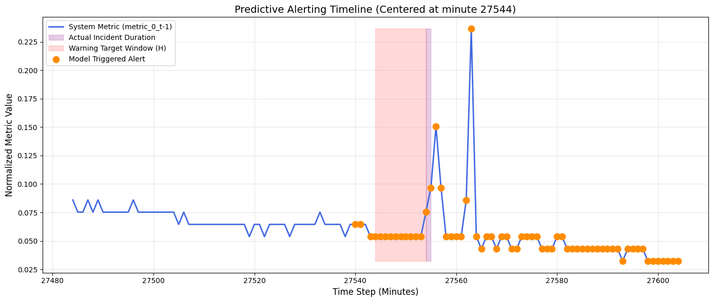

# Predictive Alerting System for Cloud Service Incidents

## 📌 Project Overview
The goal of this project is to design and implement a predictive alerting system that anticipates cloud service incidents based on historical metric data

This project implements an end-to-end Machine Learning pipeline using the **Server Machine Dataset (SMD)** URL: https://www.kaggle.com/datasets/mgusat/smd-onmiad

## ⚙️ Problem Formulation
Cloud service metrics are naturally noisy, heavy-tailed, and constantly evolving. To frame this as a supervised learning problem, I utilized a **sliding window approach**:
* **Window Size (W = 30):** The model observes the previous 30 minutes of system metrics to establish context and trajectory
* **Forecast Horizon (H = 10):** The target variable is shifted backward by 10 minutes. The model answers the question: *"Will an incident begin at any point within the next 10 minutes?"*

## 📊 Data
I used `machine-1-1` from the **Server Machine Dataset**, which provides 38 anonymized, multivariate cloud metrics (e.g., CPU, Memory, Disk I/O) labeled with human-verified incident intervals

## 🧠 Model Selection & Training
I evaluated two ensemble methods: **Random Forest (Bagging)** and **XGBoost (Boosting)**. Deep learning architectures like LSTMs were intentionally bypassed; while they capture sequential data well, they are prone to overfitting on heavy-tailed, noisy cloud data and are difficult to deploy/retrain within strict AWS Lambda compute constraints

## 📈 Evaluation & Results
Standard evaluation (using a default 0.5 probability threshold) is insufficient for alerting systems, as missing an incident is much costlier than a false alarm

To achieve the target of **~80% recall**, I dynamically tuned the probability threshold using the Precision-Recall curve on the **Validation Set**. This threshold was then strictly applied to the completely unseen **Test Set**

**Test Set Performance:**
* **Target Recall Achieved:** 74% (Caught 25 out of 34 test incident minutes)
* **False Positive Rate (FPR):** 35.8% 
* **Average Detection Lead Time:** **7.00 Minutes** (Providing engineers a 7-minute head start to intervene).

## 🚧 Limitations & Future Improvements
* **Alert Fatigue (False Positives):** While the FPR was kept to ~35%, this still results in roughly 1,500 false alarm minutes over the test period. Future iterations should include "Alert Suppression" logic
* **Global Modeling:** This prototype was trained on a single machine (`machine-1-1`). Future work would involve training a generalized model across multiple heterogeneous servers
* **Alternative Architectures:** If Lambda compute constraints are relaxed, experimenting with 1D-CNNs or Transformer architectures might better capture complex multi-metric correlations without manual feature engineering

## 💻 How to Run
1. Clone this repository.
2. Download the SMD dataset with the provided URL
3. Install requirements: `pip install -r requirements.txt`
4. Run the main pipeline notebook: `jupyter notebook notebooks/main.ipynb`